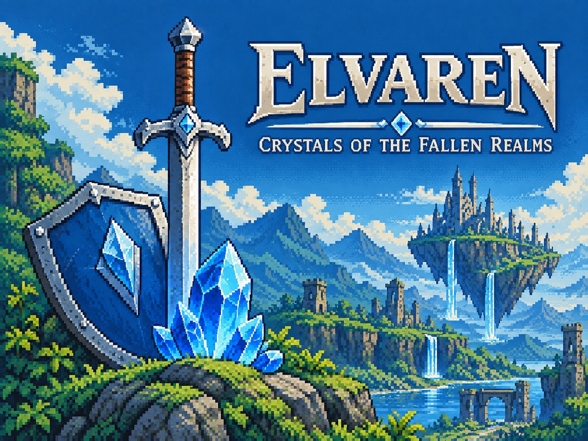

# Elvaren: Crystals of the Fallen Realms



A top-down 16-bit action / puzzle / RPG inspired by... you know. Built with **Godot 4.x** and **GDScript**.

## Overview

The hero sets out from the southern borderlands to free the eight corrupted kingdoms of **Elvaren**. Each kingdom's dungeon holds a new **secondary weapon**, a cursed boss, and a maiden who carries the **crystal** to the next realm. The final captive is the **princess**, held by the northern ghoul in his citadel.

This repo currently contains the **Thornveil vertical slice**: a deterministic 8×8 screen-based overworld, biome-specific blobs, bats, snakes, skeletons, and sandworms, sword combat and rolling, enemy health drops, a forest dungeon with the **Forest Bow**, a switch-and-door puzzle, the **Bramble Lord** boss, and the maiden rescue flow.

## Project Structure

```
res://
  autoload/         # Singletons (InputEvents, GameState, PlayerData, etc.)
  scripts/          # Gameplay scripts, state machines, data classes
  scenes/           # .tscn scene files
  assets/           # Placeholder art and audio
  data/             # JSON data (items, dialog, etc.)
```

## Requirements

- **Godot 4.3+** (GL Compatibility renderer)
- Target platforms: macOS, Linux, Web

## Getting Started

1. From the project folder, build (import / compile check) and run:

   ```bash
   make build
   make run
   ```

2. Or open `project.godot` directly in the Godot editor and press **Play**.

3. From the main menu, choose **New Game** to begin in the southern Hearthlands. Thornveil Gate is one screen north and one screen east of the starting area.

## Controls

| Action            | Keyboard | Xbox Controller |
|-------------------|----------|-----------------|
| Move              | WASD     | Left stick / D-pad |
| Attack            | X        | X               |
| Action / Interact | Z        | A               |
| Item (bow)        | C        | B               |
| Roll / Dash       | V        | RB              |
| Menu              | Esc      | Start           |

## Save & Load

The game auto-saves when you rescue the maiden. Choose **Continue** from the main menu to resume.

## Design Notes

- Base resolution: **384 × 288** (4:3), integer-scaled to **1152 × 864** (3×).
- Overworld: **8 × 8** high-level map screens; each screen uses a **24 × 18** grid of 16×16 logical base tiles.
- Region generation is deterministic, with authored landmarks layered into generated biome screens.
- Defeated enemies have a **25% chance** to drop a health pickup that restores one heart.
- All enemies obey solid terrain collision and cannot pass through trees, rocks, water, walls, or closed doors.
- Terminology: a **base tile** is 16×16; a **map screen** is one 384×288 high-level cell in the 8×8 overworld.
- Press **Esc** / **Start** during play to open the 8×8 overview map.
- Generation design is informed by [Mapgen4](https://www.redblobgames.com/maps/mapgen4/), [MapToMAP](https://gamstersmith.itch.io/tiled-map-generator), and [Grid Sage Games' map-generation notes](https://www.gridsagegames.com/blog/2014/06/procedural-map-generation/).
- Renderer: **gl_compatibility** for broad web/low-end support.
- Placeholder art is colored blocks / SVGs so user assets can replace them without renaming.
- See `AGENTS.md` for the full living design document and coding conventions.

## License

[To be determined]
